# Bipartite-and-fair-VGAE
Bipartite and fair adaptation of Kipf's VGAE in python. 

Code for the simulated part is in the simulation folder.
Code for replication of the Spipoll sampling process is in the spipoll_simulation folder.
Application on the Spipoll dataset, from 2016 to 2020, is available in the spipoll folder.

# A. The Linear Embedding Case

$$\vec{v} = \begin{bmatrix} X \\\ Y \end{bmatrix}$$

## A.1 Overview
Let $X$ a $n\times d$ matrix and let $S$ be $n \times d_s$ matrix. Without loss of generality, we assume that each column of $X$ has been centered. We wish to perform a one dimensional principal component analysis on $X$ that would yield us a vector $v$ and a lower dimensional embedding of $X$ given by $Xv$ that maximizes the variance. However, we wish to have a latent representation $Xv$ independent of the protected variable $S$.  

If we were in the context of probabilistic PCA (Tipping and Bishop, 1999)  where $X$ and $S$ would have been multivariate Gaussian, 
projecting $X$ onto the space orthogonal to $S$ (written as $S^\perp$) beforehand would have been enough to guarantee the independence between $S$ and the latent representation $Xv$, this can be solved using PPCA with covariates (Kalaitzis and Lawrence, 2012). 

We show that this approach is equivalent to find the optimal projection with respect to an independence constraint.

We note $P_S = S(S^\top S)^{-1}S^\top$ the orthogonal projection on the span of $S$ and  $P_{S^\bot}=I_d - P_SX$ the orthogonal projection on the space orthogonal to the span of $S$. 

## A.2 Proposition 

Assume that $X$ is centered. Let $\Lambda = \frac{1}{n} X^\top X$. Assume that $X$ and $S$ are jointly Gaussian. The solution of the maximization problem given by
the following Lagrangian:

$$L(v) = v ^\top \Lambda v + \lambda_1 (1-v^\top v) + \lambda_2 \Vert S^\top Xv\Vert ^2$$

can also be obtained by computing the first component of the PCA of $P_{S^\bot}X$. 

## A.3 Proof

We can see that:

$$X^\top X = (P_SX + P_{S^\bot}X)^\top (P_SX + P_{S^\bot}X) = (P_SX)^\top P_SX + (P_{S^\bot}X)^\top P_{S^\bot}X$$

and 

$$\Vert S^\top Xv\Vert ^2 = v^\top X^\top S S^\top Xv,$$

thus, we have:

$$L = \frac{1}{n}v ^\top(P_SX)^\top P_SXv + \frac{1}{n} v ^\top(P_{S^\bot}X)^\top P_{S^\bot}Xv + \lambda_1 (1-v^\top v) + \lambda_2 \Vert S^\top Xv\Vert ^2.$$

Deriving the Lagrangian yields:

$$\frac{\partial L}{\partial v} = \frac{2}{n}(P_SX)^\top P_SXv + \frac{2}{n} (P_{S^\bot}X)^\top P_{S^\bot}Xv - 2\lambda_1 v + \lambda_2 2 X^\top S S^\top Xv = 0$$

$$\frac{\partial L}{\partial \lambda_1} = 1-\Vert v\Vert ^2 = 0, \quad \frac{\partial L}{\partial \lambda_2} = \Vert S^\top Xv\Vert ^2 = 0.$$

First, we see that $\Vert S^\top Xv\Vert ^2 = 0 \implies S^\top Xv = 0$, which allows us to plug into the derivative equation:

$$\frac{\partial L}{\partial v} = \frac{2}{n}(P_SX)^\top P_SXv + \frac{2}{n} (P_{S^\bot}X)^\top P_{S^\bot}Xv + 2\lambda_1 v = 0.$$

Moreover, $P_S = S(S^\top S)^{-1}S^\top$, thus $P_SXv = S(S^\top S)^{-1}(S^\top Xv) = 0$. Finally, the derivative simplifies to:

$$\frac{2}{n} (P_{S^\bot}X)^\top P_{S^\bot}Xv - 2\lambda_1 v = 0$$

which is equivalent to searching for $\lambda_1$ and $v$ such that:

$$\frac{1}{n} (P_{S^\bot}X)^\top P_{S^\bot}Xv = \lambda_1 v.$$

in other words, we are looking for the eigenvalues of the covariance matrix of $X$ projected on $S^\top$, which is the same as performing a PCA on  $P_{S^\bot}X$.

## A.4 Comparison of fair linear embedding

Let  $S_i\sim \mathcal{N}(0,1)$ i.i.d. and $T_i\sim \mathcal{N}(0,1)$ i.i.d.for $i \in 1,\dots,n=1000$. Assume that $S \bot T$ and let $Z = (S,T)$. Let $K_{i,j} \sim \mathcal{N}(0,9)$ i.i.d be a $2 \times 5$ matrix. Suppose that we observe the $n \times 5$ matrix $X=ZK$  and the protected variable $S$. 

We wish to perform a linear embedding 

$$X \xrightarrow{\text{Linear}} Z \xrightarrow{\text{Linear}} \widehat{X}$$

with three different methods, principal component analysis on $X$, principal component analysis on  $P_{S^\bot}X$, and  principal component analysis on $X$ using the HSIC loss between the latent space and $S$ as an additional loss term. This is the introductory case, where the optimal solution can be obtained with a projection. We aim to investigate if using the HSIC as a loss in this setting would yield a result similar to the optimal one.

**Principal component analysis using $X$**

  We consider an encoder $f_{W_0}$ with a one layer neural network of 5 input nodes and 2 output nodes, and a decoder $g_{W_1}$ with 2 input nodes and 5 output nodes. We optimize the weights of the auto-encoder with respect to the mean squared error loss: 

$$\mathcal{L} (W_0,W_1) = \frac{1}{n} \Vert g_{W_1}(f_{W_0}(X))-X\Vert . $$

**Principal component analysis using $P_{S^\bot}X$**

  We consider an encoder $f_{W_0}$ with a one layer neural network of 5 input nodes and 2 output nodes, and a decoder $g_{W_1}$ with 2 input nodes and 5 output nodes. We optimize the weights of the auto-encoder with respect to the mean squared error loss: 

$$\mathcal{L} (W_0,W_1) = \frac{1}{n} \Vert g_{W_1}(f_{W_0}(P_{S^\bot}X))-X\Vert  .$$

The difference between the precedent model is that the encoder takes as input $P_{S^\bot}X$. In our case, this would erase all effect from the protected variable in the latent space.

**Principal component analysis using $X$ and the HSIC loss**

  We consider an encoder $f_{W_0}$ with a one layer neural network of 5 input nodes and 2 output nodes, and a decoder $g_{W_1}$ with 2 input nodes and 5 output nodes. We optimize the weights of the auto-encoder with respect to the MSE and HSIC loss: 

$$\mathcal{L}(W_0, W_1) = \frac{1}{n} \Vert g_{W_1}(f_{W_0}(X)) - X\Vert + \delta RFF\, HSIC(f_{W_0}(X), S)$$

Here we have chosen $\delta = 10^5$. 

For all the presented method, we fit the weights using 200 steps of the Adam algorithm with learning rate 0.01. For the HSIC loss, we fit the  algorithm 10 times with different initialization before selecting the one with the lowest HSIC value.
We then simulate a test set of 200 observations following the same probability law than the training test. Mean squared error, HSIC, number of time the independence hypothesis is rejected, and the Euclidean norm of the covariance between the latent space and the protected variable $S$ are reported in table A.

**Table A: Comparison between the PCA, the projected PCA and the HSIC PCA**

| | PCA | PCA with Projection | PCA with HSIC |
| :--- | :--- | :--- | :--- |
| **MSE** | $7.16\times 10^{-2} \pm 21.4\times 10^{-2}$ | $9.88 \pm 6.34$ | $8.80 \pm 5.54$ |
| **HSIC** | $3.15\times 10^{-2} \pm 1.02\times 10^{-2}$ | $1.15\times 10^{-3} \pm 0.60\times 10^{-3}$ | $2.21\times 10^{-3} \pm 4.81\times 10^{-3}$ |
| **p < 0.05** | 100/100 | 3/100 | 10/100 |
| **Correlation** | $0.991 \pm 0.229$ | $0.068 \pm 0.049$ | $0.142 \pm 0.241$ |

Removing the protected variable $S$ from the original data $X$ has increased the MSE, which was the expected behavior because $X$ depends on $S$. However, doing the projection or adding the HSIC as a penalty term in the loss have yielded results where the latent space became independent of the protected variable. Looking at Figure A, we can see an example where the latent space of the PCA with projection and the PCA with HSIC are similar.

<table>
  <tr>
    <td align="center">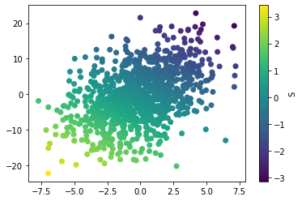 <b>PCA (S)</b></td>
    <td align="center">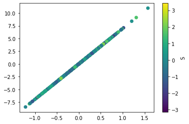 <b>Projected (S)</b></td>
    <td align="center">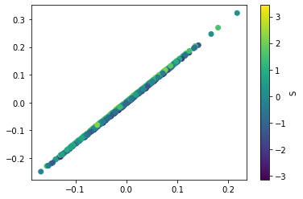 <b>HSIC (S)</b></td>
  </tr>
  <tr>
    <td align="center">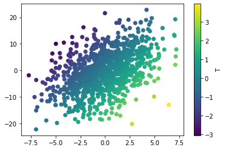 <b>PCA (T)</b></td>
    <td align="center">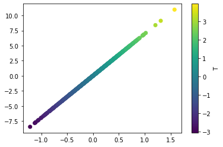 <b>Projected (T)</b></td>
    <td align="center">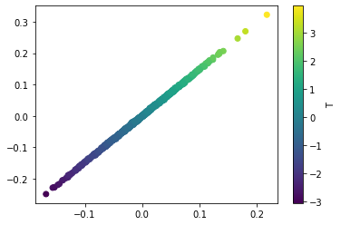 <b>HSIC (T)</b></td>
  </tr>
</table>

**Figure A: Latent representation of the linear embedding performed on $X$ (left), performed on $P_{S^\bot}X$ (middle), and performed on $X$ with the HSIC loss (right). The latent space is colored according to the protected variable $S$ (top) and the variable $T$ (bottom). Adding the HSIC as a loss term yielded similar latent space as making the embedding on $P_{S^\bot}X$, except that the points are not perfectly aligned.**

# B. Extensive simulation study
## B.1 Simulation in the simple case
### B.1.1 Setting

In this simulation, we are going to generate bipartite networks made of $n_1=1000$ rows and $n_2 =100$ columns. 
Let $S_i\sim \mathcal{N}(0,1)$ i.i.d. for $i = 1,\dots,n_1$ and $T_i \sim \mathcal{N}(0,1)$ i.i.d. for $i = 1,\dots,n_1$ and independent of $S$. We suppose that $S$ is the protected variable. Let $Z_1 = (S,T) \in \mathbb{R}^{n_1 \times 2}$ be the 2-column matrix made with both $S$ and $T$. Let $Z_{2i}$ i.i.d. such as for each $i$,

$$Z_{2i} \sim \mathcal{N}\left(\begin{bmatrix} 0\\\0 \end{bmatrix}, \begin{bmatrix} 1 & 0 \\\ 0 & 1 \end{bmatrix}\right)$$ 

We simulate our bipartite adjacency matrix with a Bernoulli distribution $B_{i,j} \sim \mathcal{B}(sigmoid(z_{1i}^\top\mathbf{I}\_{D\_+,D\_-}z_{2j}))$ i.i.d. A visualization of the simulated latent space is presented in Figure B.1.1.

First, we fit a classical bipartite and variational graph auto-encoder on $B_{i,j}$. We expect that this auto-encoder would yield a latent representation $\tilde{Z_1}$ correlated with $S$ and $T$. 
We then fit our bipartite and fair auto-encoder to compare the results and see if the yielded latent space is independent of $S$. We also compare our methodology with an adversarial learning algorithm (ADV) (Zhang et al., 2018)  where the output $\mu_1$ is then used as an input
to a 4-layer perceptron, which attempts to
predict the protected variable $S$. The loss is then penalized if the predicted output is correlated with the protected variable. 

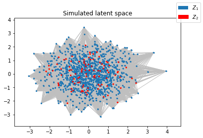

**Figure B.1.1 : Simulated latent space for generating bipartite network $B_{i,j}$. $Z_1 = (S,T)$ is represented in blue. $Z_2$ is represented in red and is independent of $Z_1$.**

### B.1.2 Results

The results for the link prediction task in the simulated network are summarized in Table B.1.2.
The simulations were done with dataset splits, with 30\% of the edges hidden. 20\% of these hidden edges are used as validation data set, and the remaining 10\% for the test set. Both sets also contain an equivalent amount of non-edges that are not in the train set. We compare the methods with the area under the ROC curve (AUC) score, the $HSIC$ between the latent space $\tilde{Z_1}$ and $S$, 
the number of times the p-value associated with the HSIC independence test is lower than $0.05\%$ ($p_{0.05}$) and the Euclidean norm of the correlation matrix between $\tilde{Z_1}$ and $S$ ($cor$).
In the table, are reported the mean and standard deviation for 100 trials, except for $p_{0.05}$ which is only a count.
We set the hyperparameter $\delta = n_1$.
For each trial, the simulations begin with 10 random initializations, and were fit using 1000 iterations of the Adam algorithm with learning rate $0.01$, using a computer equipped with an Intel Xeon(R) CPU E5-1650 v4 and 32GB of RAM. The model that achieved the most favorable performance on the validation test set is then selected to evaluate the performance on the test dataset.

**Table B.1.2 : Comparison  between  the  Bipartite  variational  graph  auto-encoder  and  its  faircounterparts on 100 trials with simulated data.**

| | BVGAE | fair-BVGAE | ADV |
| :--- | :---: | :---: | :---: |
| **AUC** | $0.753 \pm 0.013$ | $0.664 \pm 0.014$ | $0.668 \pm 0.036$ |
| **HSIC** | $0.041 \pm 0.002$ | $2.36\times 10^{-6} \pm 1.18\times 10^{-6}$ | $1.57 \times 10^{-3} \pm 3.21 \times 10^{-3}$ |
| **p < 0.05** | 100/100 | 0/100 | 81/100 |
| **cor** | $0.940 \pm 0.022$ | $0.009 \pm 0.006$ | $0.12 \pm 0.195$ |

As expected in a fairness setting, the AUC for link prediction decreases when we penalized the reconstruction with the HSIC, because in our case, $S$ is directly related to the probability of connection between the nodes. However, the latent space given by the BVGAE is not independent of the protected variable $S$. This can be seen by looking at the p-value of the HSIC independence test and the correlation between $\tilde{Z_1}$ and $S$. Even if it is not enough to guarantee independence, we can see that the correlation between the latent space and the protected variable is much higher in the BVGAE than in the fair-BVGAE and ADV model. However, in all the simulations, the independence hypothesis has been rejected for the BVGAE and kept for the fair-BVGAE. The ADV model managed to have a smaller HSIC than the BVGAE, however the independence hypothesis was rejected most of the time. The ADV model is much harder to calibrate because it requires a second neural network to optimize.

<table>
  <tr>
    <td align="center">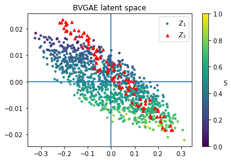 </td>
    <td align="center">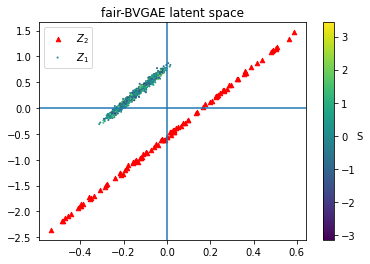 </td>
  </tr>
</table>

**Figure B.1.2 Estimated latent space for the bipartite variational graph auto-encoder (left) and the fair bipartite variational graph auto-encoder (right).**

An example of the latent space of BVGAE and fair-BVGAE can be seen in figure B.1.2. Looking at the coloring, we can see for the BVGAE that the latent space is clearly correlated with $S$ , while the latent space of the fair-BVGAE does not share structure with the protected variable $S$. The HSIC test between the fair latent space and $S$ yields us a p-value equals to $0.139$, we do not reject the hypothesis that the latent space $Z_1$ is independent of $S$. Simulation with binary protected variable is available in section B.3.

## B.2 Impact of hyperparameter $\delta$

 We remind the expression of the variational loss : 

$$\begin{align}
 L  &= \mathbb{E}_{q(Z_1,Z_2|X_1,X_2,B)}[\log p(B|Z_1,Z_2)]- KL[q_1(Z_1|X_1,B)\Vert p_1(Z_1)]\\\
 &-KL[q_2(Z_2|X_2,B)\Vert p_2(Z_2)]+ \delta RFF\; HSIC(\mu_1,S).
\end{align}$$

In this expression, $\delta$ is the hyperparameter associated with the $RFF\: HSIC$. 
Setting $\delta = 0$ yields the same result as fitting the classical BVGAE. The following simulation study is performed to study the impact of this hyperparameter on the different scores.

## B.2.1 Setting 

The settings are nearly identical as in section B.1.1.

In this simulation, we are going to generate bipartite networks made of $n_1=1000$ rows and $n_2 =100$ columns. 
Let $S_i\sim \mathcal{N}(0,1)$ for $i = 1,\dots,n_1$ and $T_i \sim \mathcal{N}(0,1)$ i.i.d. for $i = 1,\dots,n_1$ and independent of $S$. We suppose that $S$ is the protected variable. Let $Z_1 = (S,T) \in \mathbb{R}^{n_1 \times 2}$ be the 2-column matrix made with both $S$ and $T$. Let 

$$Z_{2i} \sim \mathcal{N}\left(\begin{bmatrix} 0\\\0 \end{bmatrix}, \begin{bmatrix} 1 & 0 \\\ 0 & 1 \end{bmatrix}\right) \in \mathbb{R}^{n_2 \times 2} $$

 We simulate our bipartite adjacency matrix with Bernoulli  $B_{i,j} \sim \mathcal{B}(sigmoid(z_{1i}^\top\mathbf{I}\_{D\_+,D\_-}z_{2j}))$ i.i.d.

We fit the fair-BVGAE with the variational loss $\mathcal{L}$ with hyperparameter $\delta \in$ \{0, 10, 100, 200, 500, 1000, 2000\}.  

## B.2.2 Results

The results for the link prediction task in the simulated network are summarized in Table B.2.2.
The simulations were done with  dataset splits, with 30\% of the edges hidden. 20\% of these hidden edges are used as validation data set, and the remaining 10\% for the test set. Both sets also contain an equivalent amount of non-edges that are not in the train set.
In the table are reported the mean and standard deviation for 100 trials, except for $p_{0.05}$ which is only a count.

For each trial, the simulations begin with 10 random initialization, and were fit using 1000 iterations of the Adam algorithm with learning rate $0.01$.  The model that achieved the most favorable performance on the validation test set is then selected to evaluate the performance on the test dataset.
This procedure is repeated on the same network for each value of $\delta$.

<table>
  <tr>
    <td align="center">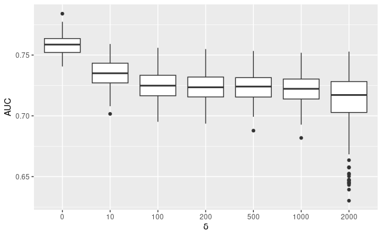 </td>
    <td align="center">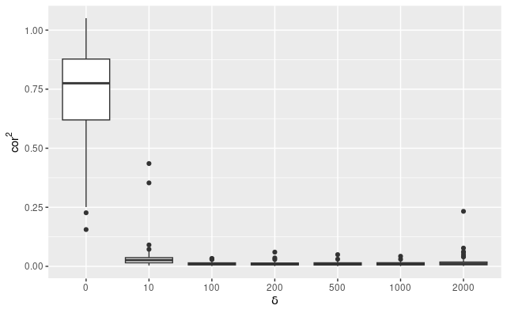 </td>
  </tr>
  <tr>
    <td align="center">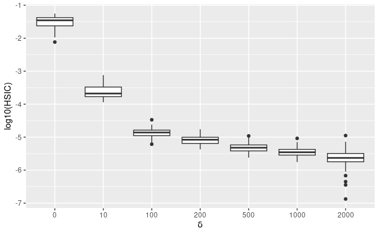 </td>
    <td align="center">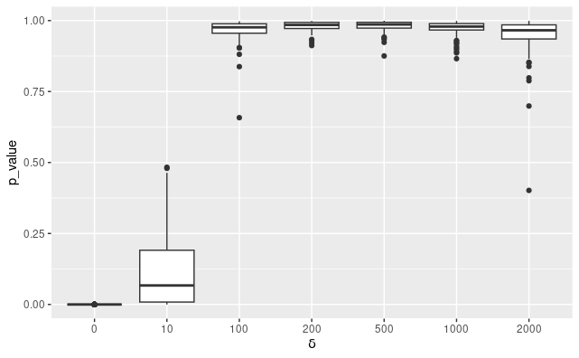 </td>
  </tr>
</table>

**Figure B.2.2 : Impact of the parameter $\delta$ on the $AUC$ (upper left), the norm of the correlation matrix (upper right), the $log_{10}$ HSIC (bottom left), and the p-value of the independence test (bottom right).**

As we see in Table B.2.2, increasing the $\delta$ parameters from 0 to 2000 decreases the $AUC$ in average from 0.758 to 0.708. However, the linear correlation and the HSIC between the latent space and the protected variable decreases to reach a value closer to 0. The more $\delta$ increases, the less the independence hypothesis is rejected. For $\delta=2000$, the algorithm is sometimes unstable. 

**Table B.2.2 : Comparison of fair and bipartite variational graph auto-encoder for different value of $\delta$ on 100 trials with simulated data**

| $\delta$ | 0 | 10 | 100 | 200 | 500 | 1000 | 2000 |
| :--- | :---: | :---: | :---: | :---: | :---: | :---: | :---: |
| **AUC** | $0.758\pm0.009$ | $0.735\pm0.012$ | $0.725\pm0.013$ | $0.724\pm0.012$ | $0.724\pm0.013$ | $0.723\pm0.013$ | $0.708\pm0.031$ |
| **HSIC** | $3.32 \times 10^{-2} \pm 1.22 \times 10^{-2}$ | $2.75\times 10^{-4} \pm 1.56\times 10^{-4}$ | $1.42 \times 10^{-5} \pm 4.37 \times 10^{-6}$ | $8.63 \times 10^{-6} \pm 2.72 \times 10^{-6}$ | $5.06 \times 10^{-6} \pm 1.65 \times 10^{-6}$ | $3.69 \times 10^{-6} \pm 1.27 \times 10^{-6}$ | $2.64 \times 10^{-6} \pm 1.50 \times 10^{-6}$ |
| **$p < 0.05$** | 100/100 | 44/100 | 0/100 | 0/100 | 0/100 | 0/100 | 0/100 |
| **cor** | $0.735\pm0.206$ | $0.035\pm0.055$ | $0.011\pm0.007$ | $0.011\pm0.008$ | $0.011\pm0.008$ | $0.011\pm0.008$ | $0.017\pm0.025$|

## B.3 Fair BGVAE with binary protected variable

The HSIC can encourage independence with respect to continuous variables or to categorical variables. The latter point is illustrated in this subsection.

## B.3.1 Setting

Simulations with a similar setting as in section B.1.1 has been performed with a simulated latent space structured along a binary protected variable $S\in \{-1,1\}$.

In this simulation, we are going to generate a bipartite network made of $n_1=1000$ rows and $n_2 =100$ columns. 
Let $S_i \: {i.i.d.}$ for $i = 1,\dots,n_1$ with a Rademacher distribution ( $\mathbb{P}(S_i = -1) = \mathbb{P}(S_i = 1) = \frac{1}{2}$ ) and $T_i \sim \mathcal{N}(0,1)$ i.i.d.$ for $i = 1,\dots,n_1$ and independent of $S$. We suppose that $S$ is the protected variable. Let $Z_1 = (S,T) \in \mathbb{R}^{n_1 \times 2}$ be the 2-column matrix made with both $S$ and $T$. Let $Z_2\overset{i.i.d.}{\sim} \mathcal{N}\left(\begin{bmatrix} 0\\0 \end{bmatrix}, \begin{bmatrix} 1 & 0 \\ 0 & 1 \end{bmatrix}\right)\in \mathbb{R}^{n_2 \times2}$. We simulate our bipartite adjacency matrix with Bernoulli  $B_{i,j} \overset{i.i.d.}{\sim}  \mathcal{B}(sigmoid(z_{1i}^\top\mathbf{I}_{D_+,D_-}z_{2j}))$. A visualization of the simulated latent space is presented in Figure B.3.1.

First, we fit a classical bipartite and variational graph auto-encoder on $B_{i,j}$. We expect that this auto-encoder would yield a latent representation $\tilde{Z_1}$ correlated with $S$ and $T$. 
We then fit our bipartite and fair auto-encoder to compare the result and see if the yielded latent space is independent of $S$.

!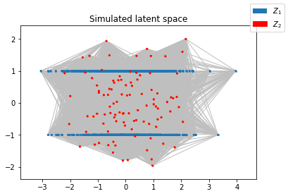

**Figure B.3.1 : Simulated latent space for generating bipartite network $B_{i,j}$. $Z_1 = (T,S)$ is represented in blue. $Z_2$ is represented in red and is independent of $Z_1$.**

## B.3.2 Results

Results for the link prediction task in the simulated network are summarized in Table 3.2.
The simulations were done with  dataset splits, with 30\% of the edges hidden. 20\% of these hidden edges are used as validation data set, and the remaining 10\% for the test set. Both sets also contain an equivalent amount of non-edges that are not in the train set.
In the table are reported the mean and standard deviation for 100 trials, except for $p_{0.05}$ which is only a count.
We set the hyperparameter $\delta = n_1=1000$. For each trial, the simulations begin with 10 random initialization, and were fit using 1000 iterations of the Adam algorithm with learning rate $0.01$.  The model that achieved the most favorable performance on the validation test set is then selected to evaluate the performance on the test dataset.

<table>
  <tr>
    <td align="center">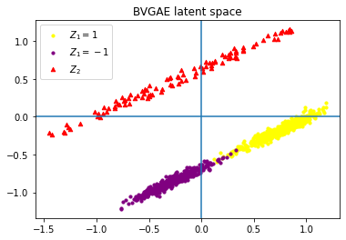 </td>
    <td align="center">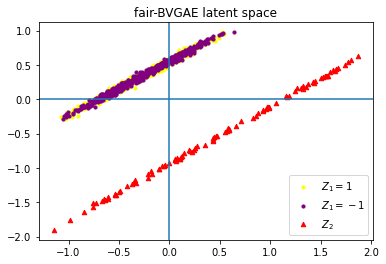 </td>
  </tr>
</table>

**Figure B.3.1 : Estimated latent space for the bipartite variational graph auto-encoder (left) and the fair bipartite variational graph auto-encoder (right) in the binary case.**

As shown in Figure B.3.2,
we are able to provide an embedding independent of the binary variable with our fair VGAE contrary to the embedding provided by the simple VGAE. Average values and standard deviation of several metrics are reported in Table B.3.2. As expected, the average AUC decreases in the fair model compared to the classical case, however in the fair case, we do not reject the hypothesis of independence between the latent space and the protected variable. The adversarial setting decreases the correlation and the HSIC compared to the classical BVGAE, but the independence hypothesis has been rejected 46\% of the time.

## B.4 Temporal gain using RFF HSIC

The purpose of this study is to see the temporal gain of using the RFF HSIC instead of $\widehat{HSIC}$ for different value of $n$, and to see if $RFF\ HSIC$ is an accurate approximation of  $\widehat{HSIC}$.

### B.4.1 Setting

For various value of $n$, we consider $X$ a $n\times 4$ matrix, with entries such as $X_{i,j} \sim \mathcal{N}(0,1)$ i.i.d.. Let $S$ be a $n \times 4$ matrix. Under the null hypothesis, we consider that $S$ is independent of $X$, with $S_{i,j} \sim \mathcal{N}(0,1)$ i.i.d.. Under the alternative hypothesis we consider that $S= 3X$. The aim is to compute the HSIC between $X$ and $S$ with $\widehat{HSIC}(X,S)$, $RFF\ HSIC(X,S)$ and their respective gradient, under both hypothesis.
In our fairness setting, $S$ would represent the protected variable and would be fixed once and for all, while $X$ would change according to the computed gradient. Therefore, we evaluate $L_{i,j} = L(s_i,s_j) = e^{-\frac{\Vert s_i-s_j\Vert ^2}{2}}$, $L' = \sum_{1\leq p,q\leq n} L_{q,p}$, and $L''_{i} = \sum_{q =1}^n L_{i,q}$ in advance to perform a quicker computation :  

$$\begin{aligned}
\widehat{HSIC} &= \frac{1}{n^2}\sum_{1\leq i,j\leq n}K_{i,j}L_{i,j} + \frac{1}{n^4}\sum_{1\leq i,j\leq n}K_{i,j} \left( \sum_{1\leq p,q\leq n} L_{p,q} \right) - \frac{2}{n^3}\sum_{1\leq i,j\leq n}K_{i,j} \left( \sum_{q=1}^n L_{i,q} \right) \\
&= \frac{1}{n^2}\sum_{1\leq i,j\leq n}K_{i,j}L_{i,j} + \frac{L'}{n^4}\sum_{1\leq i,j\leq n}K_{i,j} - \frac{2}{n^3}\sum_{1\leq i,j\leq n}K_{i,j}L''_i
\end{aligned}$$

For multiple random realisations of $X$, we compute $K_{i,j} = e^{-\frac{\Vert x_i-x_j\Vert ^2}{2}}$ and then plug it in the equation. We also compute the gradient with respect to $X$ using Pytorch automatic differentiation, before measuring the average time taken to realize both of these operations.

Using the method presented by Zhang et al. (2018), we also compute the $RFF\ HSIC$ between $X$ and $S$ with $h = \left\lceil\sqrt{n}\right\rceil$, and its gradient using Pytorch automatic differentiation. We measure the average time taken to calculate the $RFF\ HSIC$ and its gradient compared to the $\widehat{HSIC}$. We also compare how close the value of $RFF\ HSIC$ is to the $\widehat{HSIC}$ using the squared error between the two with $\widehat{HSIC}$ as a base value. All theses computation are realized on an Intel Xeon(R) CPU E5-1650 v4 and 32GB of RAM.

### B.4.2 Results

!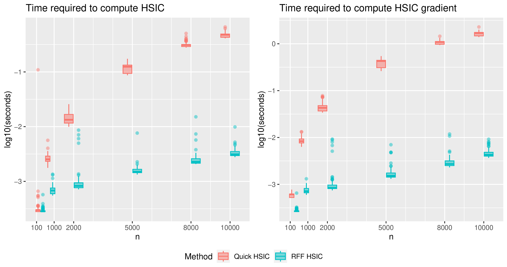

**Figure B.4.2 : Estimated latent space for the bipartite variational graph auto-encoder (left) and the fair bipartite variational graph auto-encoder (right) in the binary case.**

As we can see in Figure B.4.2, using the $RFF\ HSIC$ is much faster than $\widehat{HSIC}$ by a large margin. Under the null hypothesis, the estimation is less accurate than under the alternative hypothesis (Figure B.4.3) but the hypothesis doesn't affect the computation time. For 1000 iterations and for $n=10000$, the $RFF\ HSIC$ and its gradient would require around 7.9 seconds of computation time, while the $\widehat{HSIC}$ would require around 35 minutes. In the Spipoll dataset, we have considered $n=12574$ with a latent space of dimension 4. Using a second order polynomial, we can estimate that computing $1000$ times the HSIC and its gradient would require around 56 minutes for $\widehat{HSIC}$ and 11 seconds for $RFF\ HSIC$. We also only presented results from data in the time period between 2017 and 2020, but if we considered the Spipoll data set from 2010 to 2020, then $n \approx 26000$. In this case, we can estimate that computing $1000$ times the HSIC and its gradient would require around 4 hours with $\widehat{HSIC}$ while the $RFF\ HSIC$ would only need 33 seconds. All these estimations are done without taking into account the fact that the computation of the $n \times n$ Gram matrix, needed for the $\widehat{HSIC}$ can also require a lot of memory from the computer.

!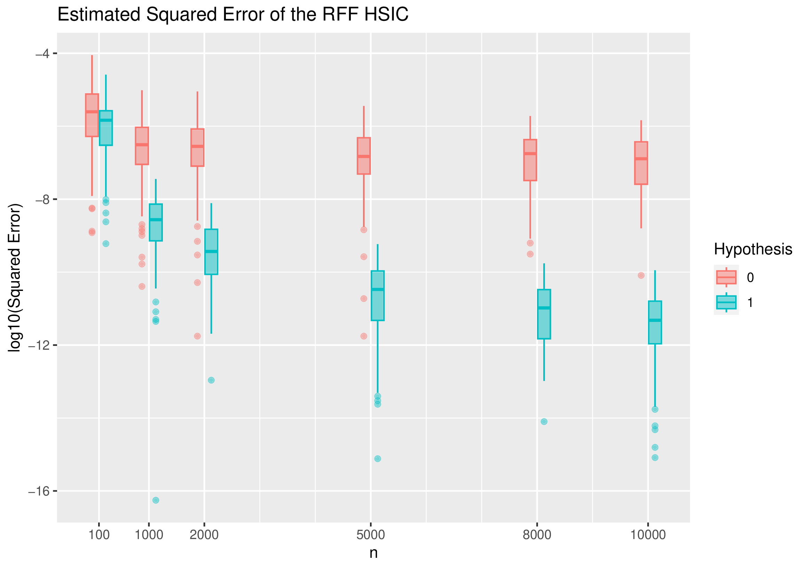

**Figure B.4.3 : Estimated latent space for the bipartite variational graph auto-encoder (left) and the fair bipartite variational graph auto-encoder (right) in the binary case.**

# C. Latent space representation of Spipoll

The observed plant-pollinator network is provided in Figure C.0.

In addition to the reconstructed plant-pollinator network, the
method provides an embedding of dimension $D = D_+ + D_- = 4$ with $D_+ = D_- = 2$, which means that for the first two dimensions, insects and sessions that are embedded in the same direction are more likely to be connected, and the ones in the opposite direction are less likely to be connected. On the contrary, insects and sessions that are embedded in the same direction for the third and fourth dimensions are less likely to be connected, while the ones in the opposite direction are more likely to be connected. The choice of $D_+ = D_- = 2$ is justified by looking at Figure C.1. The session-pollinator embedding can be seen in Figure C.2 and Figure C.3.

!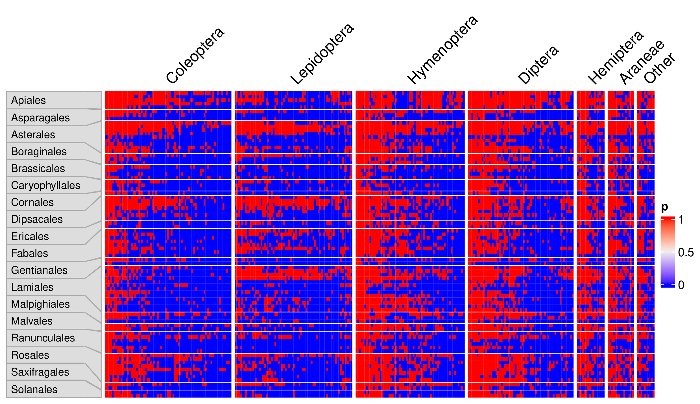

**Figure C.0 : Observed initial plant-pollinator network of the Spipoll dataset.**

## C.1 Spipoll, exploration with higher dimensional latent spaces

In the paper, we show in detail the results for the case where the latent space has 4 dimensions with $D_+ = D_- = 2$. We justify this choice by looking at the estimated mean of the $AUC(\widehat{B})$ for different numbers of dimensions for the latent space. Looking at Figure C.1, we can see that the $AUC(\widehat{B})$  doesn't significantly change for higher values of $D_+$ and $D_-$.

<table>
  <tr>
    <td align="center">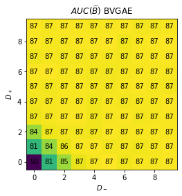 </td>
    <td align="center">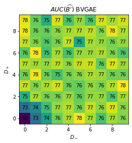 </td>
  </tr>
  <tr>
    <td align="center">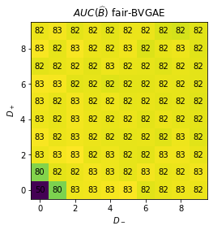 </td>
    <td align="center">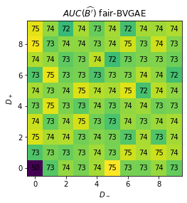 </td>
  </tr>
</table>

**Figure C.1 : Estimated mean on 10 trials for the $AUC(\widehat{B})$ (left) and $AUC(\widehat{B'})$ (right) for link prediction in the Spipoll data set using BGVAE (top) and the fair-BGVAE (bottom) for various values of $D_+$ and $D_-$.**

## C.2 Latent space representation

!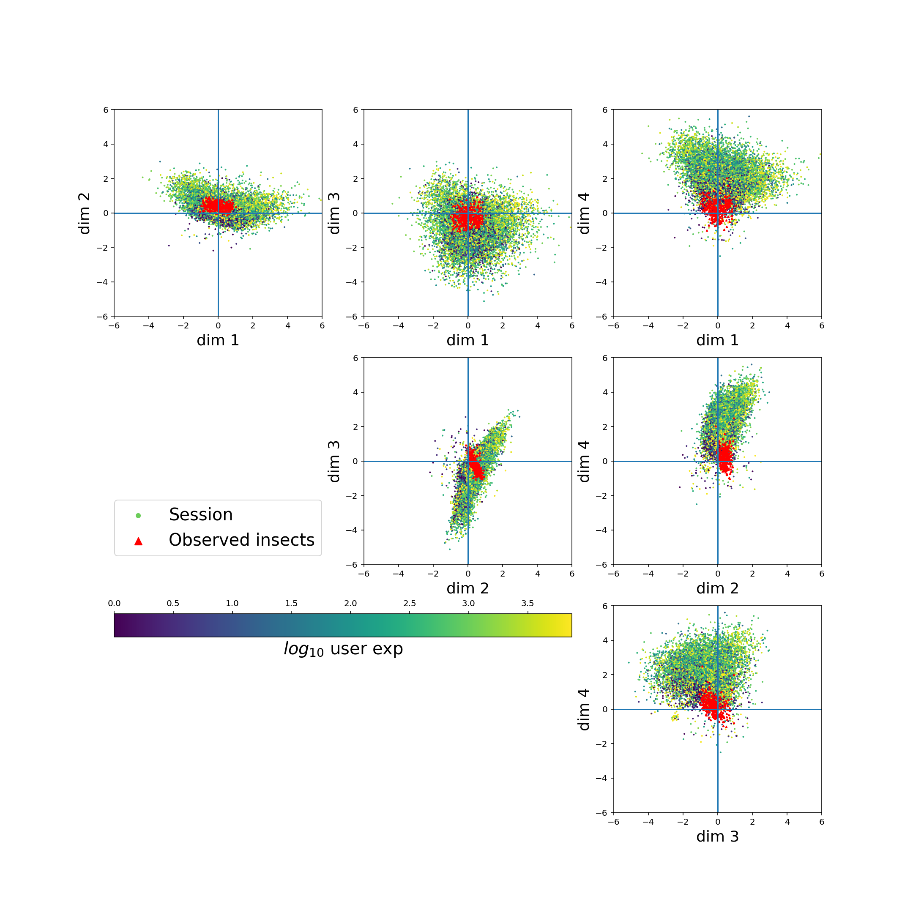

**Figure C.2 : Estimated latent space for the Spipoll data set using BVGAE.**

!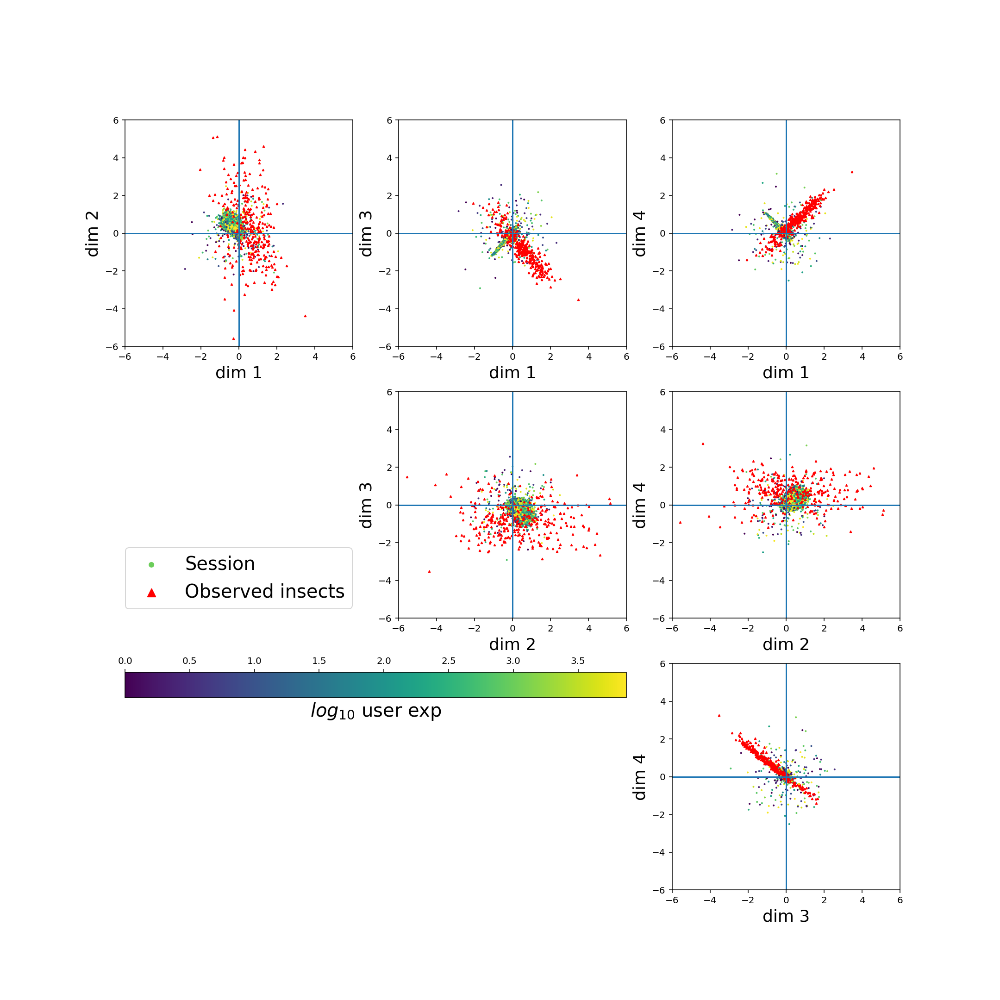

**Figure C.3 : Estimated latent space for the Spipoll data set using fair-BVGAE.**
